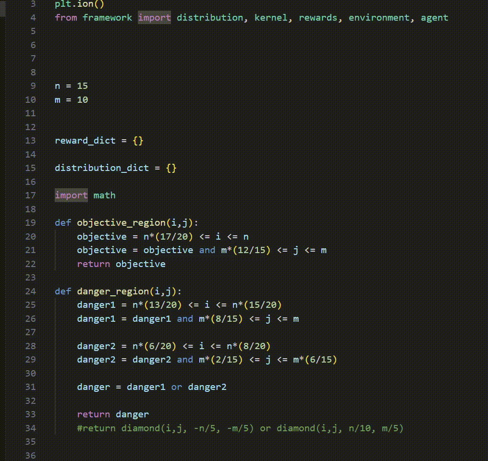
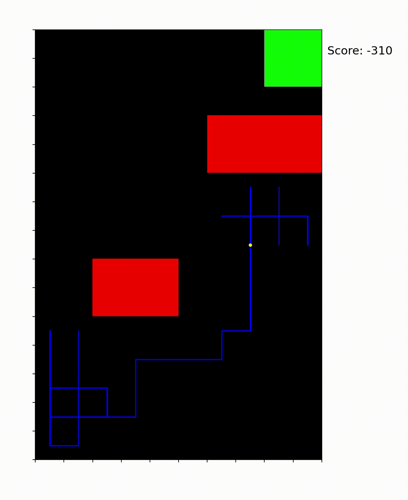
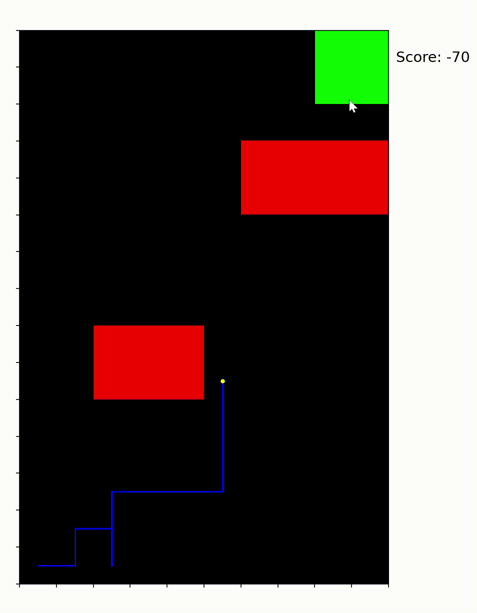

Finite dimensional environments for now. Deep-learning framework could come in separate repo. Current example setup is gridworld with score subtracting red areas and objective green area. Gifs attached.

The agent begins purely exploring, with no clue where to go. The rewards perceived and its improving perception of the environment, represented by the Q-Estimate, leads it to learn the best path through iterations.

## Visualizations

<table>
  <tr>
    <td align="center">
       
      Initial
    </td>
    <td align="center">
       
      After a few runs
    </td>
    <td align="center">
       
      Near-perfect
    </td>
  </tr>
</table>

